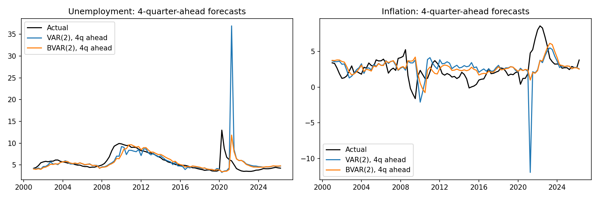
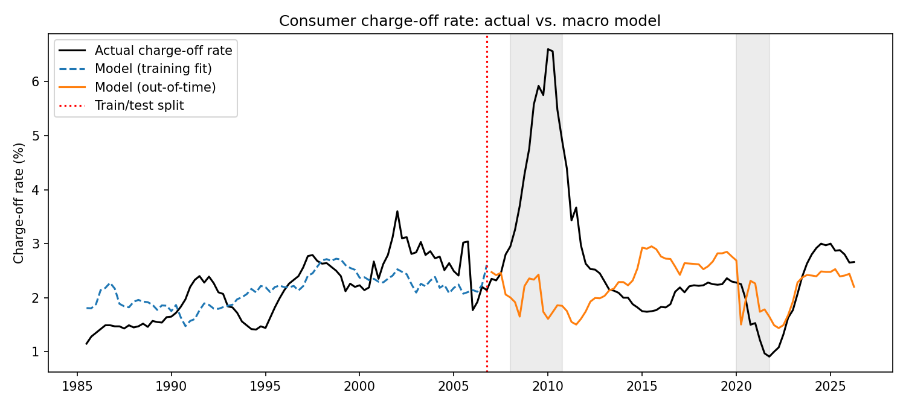
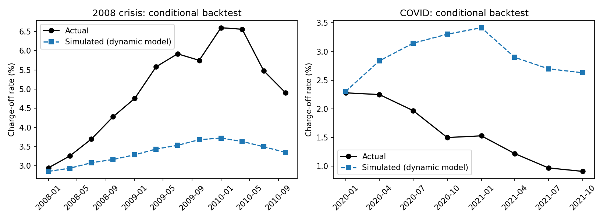
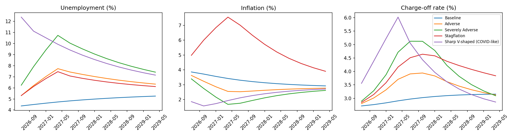

# Macro-Driven Credit Risk Lab

[](https://github.com/3JSaunders1/macro-credit-risk-lab/actions/workflows/tests.yml)

A macro stress-testing platform: five macroeconomic forecasting models (VAR, Cholesky and sign-restricted SVARs, a Minnesota-prior Bayesian VAR, and local projections), a dynamic credit loss model estimated on 40 years of consumer charge-off data, and a scenario engine that propagates structural shocks through the Bayesian VAR into projected losses. Every component is validated out of sample: forecasts against a random walk, the loss model through the 2008 crisis and COVID, and stress scenarios against actual 2008 losses. Includes a FastAPI service, an interactive Streamlit dashboard, Docker images for both, structured logging, automated tests, and an honest account of limitations.

---

## Key Findings at a Glance

| | Result |
|---|---|
| **Data** | Rebuilt reproducibly from FRED: 166 quarters, 1985 to 2026, covering four recessions, with the October 2025 shutdown gap documented and interpolated |
| **Static credit model** | A levels regression of charge-offs on unemployment and inflation **fails out of time**: worse than the historical average, and misses 2008 losses by 3 points |
| **Dynamic loss model** | Persistence plus the 4-quarter change in unemployment beats naive persistence one step ahead (RMSE 0.27 vs. 0.30 pp) |
| **2008 conditional backtest** | A model trained through 2006, fed the actual 2008 macro path, captures the rise but only **67% of cumulative losses**: it had never seen a severe recession |
| **COVID** | A pre-2020 model would have overpredicted pandemic losses by 84%; stimulus and forbearance broke the usual relationship |
| **Forecasts vs. random walk** | Outside COVID, the VAR is 18% more accurate for next-quarter unemployment; COVID breaks it (errors up to 2x the random walk), while the BVAR stays robust |
| **Statistical significance** | No forecast gain is significant (all Diebold-Mariano p > 0.10): the random walk is a hard benchmark |
| **Interval coverage** | 90% intervals cover 84-89% of outcomes one quarter out, but only 73-83% four quarters out |
| **Stress scenarios** | A Severely Adverse scenario with 2008-level unemployment produces **9.5%** cumulative 9-quarter losses vs. **10.7%** actual in 2008-2010, about 12% short |
| **Model review** | Eight errors found and corrected in the original version, including hard-coded forecast intervals, a mis-specified Minnesota prior, and non-structural "structural" impulse responses |
| **Engineering** | 67 automated tests in CI (including a dashboard smoke test), Docker images for the API and dashboard, structured logging with step timing and failure handling, pinned dependencies, a one-command pipeline, and timestamped run archives |

---

## 1. Purpose

Bank stress testing (CCAR/DFAST) and CECL reserving both ask the same question: **if the economy follows a given path, how much will the loan book lose?** This project builds that chain end to end:

> **Macro scenario → macro paths (structural VAR dynamics) → credit losses (dynamic loss model) → cumulative losses**

and validates each link the way a model risk team would: out-of-sample forecasts against a benchmark, conditional backtests of the loss model, and scenario results compared with history.

It complements my [Credit Default Prediction Model](https://github.com/3JSaunders1/credit-default-model), which models borrower-level default. This project models how the macroeconomy drives portfolio-level losses. The two are linked in my [Credit Risk Platform](https://github.com/3JSaunders1/credit-risk-platform), which runs these stress scenarios through loan-level PDs to estimate losses for a real loan portfolio.
---

## 2. Data

All data comes from the **FRED API** (Federal Reserve Bank of St. Louis), built by `pipeline/fetch_data.py`:

| Variable | FRED series | Transformation |
|---|---|---|
| Unemployment | `UNRATE` (monthly) | Quarterly average |
| Inflation | `CPIAUCSL` (monthly) | Year-over-year % change of the quarterly average |
| Consumer charge-off rate | `CORCACBS` (quarterly) | As published; the credit loss target |

**166 quarters, 1985 Q1 to 2026 Q2.** Every transformation is recorded in `data/macro_data_meta.json`.

**Data decisions worth noting:**
- **Complete quarters only.** A quarter is kept only if all three months are available, so a partially published latest quarter never enters the models.
- **The October 2025 gap.** October 2025 unemployment and CPI were not collected during the federal government shutdown. These single interior months are linearly interpolated and documented in the metadata; trailing missing months are never filled.
- **Consecutive quarters are enforced.** The build fails if any quarter is missing, since time-series models silently misalign lags across gaps.
- **Why the data was rebuilt.** The original dataset covered only 2010-2024 (60 quarters), sampled one month per quarter rather than averaging, had no documented source, and missed the 2008 crisis entirely.

---

## 3. Architecture

```
FRED API → pipeline/fetch_data.py → data/macro_data.csv
                                         │
          ┌──────────────────────────────┼──────────────────────────────┐
          ▼                              ▼                              ▼
  Forecasting models             Credit loss model               Forecast backtest
  VAR · SVAR (Cholesky)          dynamic fractional logit        rolling, out of sample
  SVAR (sign) · BVAR · LP        + conditional backtests         vs. random walk
          │                              │
          └──────────────┬───────────────┘
                         ▼
                 Scenario engine  ←  config/scenarios.py (single source of truth)
          BVAR structural shocks → macro paths → loss paths → 9-quarter losses
                         │
          ┌──────────────┼──────────────┐
          ▼              ▼              ▼
     FastAPI          Streamlit       CLI / Makefile
          └──────┬───────┘
                 ▼
     Docker image + docker-compose
```

---

## 4. Forecasting Models

All five models share one interface (`fit`, `forecast`, `forecast_interval`, `irf`) through `models/model_adapter.py`, with shared VAR math (companion matrix, stability, impulse responses, forecast error variances, FEVD) in `models/var_utils.py`.

| Model | File | Identification and notes |
|---|---|---|
| **VAR** | `var_model.py` | Reduced form; responses to one-unit innovations (not structural) |
| **SVAR (Cholesky)** | `svar_cholesky.py` | Unemployment ordered first: inflation can respond to an unemployment shock within the quarter, but not the reverse |
| **SVAR (sign restrictions)** | `sign_restriction_svar.py` | A demand-type shock raises unemployment and lowers inflation for three quarters; 1,000 random rotations (seeded), reported as the median with 16th-84th percentile bands and the acceptance rate |
| **BVAR (Minnesota prior)** | `bvar.py` | Dummy-observation prior (Bańbura, Giannone and Reichlin 2010): each variable follows its own AR(1), other coefficients shrink to zero, shrinkage tightens at longer lags (λ = 0.2) |
| **Local projections** | `local_projections.py` | Jordà (2005): one regression per horizon on Cholesky shocks with lagged controls, HAC standard errors |

**Forecast intervals are model-based:** analytic VAR intervals, BVAR intervals from the accumulated forecast error variance, and, for local projections (which forecast as a random walk), intervals from historical h-quarter changes.

**A note on identification:** the two SVARs produce the **same forecasts** as the VAR. Identification changes how shocks are interpreted, which matters for impulse responses and scenarios, not for reduced-form forecasts.

---

## 5. Forecast Backtest

`analysis/forecast_backtest.py` runs a **rolling, out-of-sample** backtest: at every quarter from 2000 onward, each model is fit using **only data available up to that quarter**, then forecasts 1 and 4 quarters ahead. Forecasts are compared with a **random walk**, tested with the **Diebold-Mariano** test (Newey-West variance), and checked for **90% interval coverage.**

**Relative RMSE vs. the random walk** (below 1.0 beats it):

| Horizon | Variable | VAR(2), ex-COVID | BVAR(2), ex-COVID | VAR(2), full | BVAR(2), full |
|---|---|---|---|---|---|
| 1 quarter | Unemployment | **0.82** | 0.94 | 1.50 | 1.01 |
| 1 quarter | Inflation | 0.94 | 0.95 | 1.14 | 0.97 |
| 4 quarters | Unemployment | 0.93 | 0.99 | 1.98 | 0.97 |
| 4 quarters | Inflation | 0.93 | **0.89** | 1.22 | **0.89** |

"Ex-COVID" excludes target quarters in 2020-2021. Full tables, including RMSE, Diebold-Mariano statistics, and coverage: `reports/figures/forecast_backtest_*.csv`.



**Interpretation:**
- **In normal times, the VAR forecasts well,** beating the random walk by 18% for next-quarter unemployment.
- **The unrestricted VAR is fragile.** Once its estimation sample includes the 2020 spike, its unemployment forecasts become 50% to 100% worse than the random walk.
- **The BVAR is robust:** close to or better than the random walk in every condition, and the best four-quarter inflation forecaster in both samples. That robustness, not large average gains, is why shrinkage BVARs are standard at central banks, and why the scenario engine uses one.
- **No gain is statistically significant** (all Diebold-Mariano p-values above 0.10). With about 100 forecasts and highly persistent series, the random walk is hard to beat decisively.
- **Intervals are roughly right at one quarter (84-89% coverage) and too narrow at four quarters (73-83%),** since they ignore parameter uncertainty and cannot anticipate breaks like 2008 and COVID.

---

## 6. The Credit Link

### A static model fails

The original design mapped macro **levels** to credit risk: logit(loss) = β₀ + β₁·unemployment + β₂·inflation. Estimated on 1985-2006 charge-offs by fractional logit (`models/credit_estimation.py`) and tested on 2007-2026:

| Model | Out-of-time RMSE (pp) |
|---|---|
| Benchmark: training average | **1.34** |
| Static model, contemporaneous | 1.45 |
| Static model, unemployment lagged 2 quarters | 1.49 |



The static model **loses to the historical average** and predicts about 2.0% charge-offs during 2008-2010 against an actual 5.0%. Its training coefficient on unemployment is even **negative:** from the mid-1990s to mid-2000s, charge-offs rose (card growth, looser lending, the bankruptcy surge before the 2005 law) while unemployment fell, and a levels regression mistook those trends for a macro relationship. These coefficients are kept for documentation only (`config/static_model_coefficients.json`) and are not used by the pipeline.

### A dynamic loss model

Following the structure of bank stress-testing loss models (`models/loss_model.py`):

> logit(lossₜ) = a + ρ · logit(lossₜ₋₁) + b · Δ₄unemploymentₜ + c · inflationₜ + event indicators

- **Persistence (ρ):** losses move slowly
- **The 4-quarter change in unemployment,** which removes the long-run trend problem
- **Event indicators:** the 2005 bankruptcy-law filing rush (Q4 2005) and the drop after it (Q1 2006), and COVID-era policy support (Q2 2020 to Q4 2021)

**Validation** (`models/loss_validation.py`), with the model trained on 1985-2006:

| One step ahead, 2007 onward | RMSE (pp) |
|---|---|
| Naive persistence (last quarter) | 0.303 |
| Static levels model | 1.410 |
| **Dynamic loss model** | **0.268** |

**Conditional backtests,** the real stress test: start from actual losses, feed in the actual macro path, and let the model simulate forward on its own predictions:

| Episode | Start | Actual peak | Simulated peak | Cumulative loss (simulated ÷ actual) |
|---|---|---|---|---|
| 2008 crisis (from 2007 Q4) | 2.80% | 6.60% | 3.72% | **0.67** |
| COVID (from 2019 Q4) | 2.30% | 2.28% | 3.42% | **1.84** |



**Interpretation:**
- **One step ahead, the dynamic model beats every benchmark,** including naive persistence, which is hard to beat for a slow-moving series.
- **Losses are highly persistent:** ρ = 0.935 in training, a half-life of about 10 quarters. Recessions keep hurting loan books long after they end.
- **The 2008 backtest captures the direction but not the severity.** Trained only on mild recessions, the model estimated a small, imprecise unemployment effect (p = 0.17) and reproduced two-thirds of 2008's losses. **A model that has never seen a severe recession understates severe-recession losses,** which is the central reason stress tests use severe scenarios and banks apply overlays.
- **COVID broke the relationship in the other direction:** a pre-2020 model would have predicted losses 84% too high, since it could not know about stimulus and forbearance.

**Full-sample estimates** (used by the scenario engine, `config/loss_model.json`):

| Coefficient | Estimate | p-value |
|---|---|---|
| Persistence, ρ | 0.914 | < 0.001 |
| 4-quarter change in unemployment | 0.038 | < 0.001 |
| Inflation | 0.012 | 0.028 |
| COVID policy support | −0.261 | < 0.001 |
| Bankruptcy law, Q1 2006 | −0.539 | < 0.001 |

Every coefficient has an economically sensible sign once the sample includes 2008 and COVID.

---

## 7. Stress Scenarios

`pipeline/scenario_engine.py` generates scenarios the way a stress test does, from **one set of definitions** in `config/scenarios.py`:

1. **Baseline:** the BVAR(2)'s 12-quarter forecast, chosen because it was the most robust model in the backtest.
2. **Scenario paths:** structural (Cholesky) shocks propagated through the BVAR's impulse responses, built up over several quarters and scaled so each shocked variable peaks exactly at its target above baseline. How fast unemployment rises, how inflation responds, and how the economy recovers all come from the **estimated** dynamics.
3. **Losses:** the dynamic loss model, simulated forward from the latest actual charge-off rate (2.66%, 2026 Q2). No pandemic-style policy support is assumed.

| Scenario | Shock | Peak unemployment | Peak loss rate | 9-quarter cumulative loss |
|---|---|---|---|---|
| Baseline | None | 5.3% | 3.2% | 6.6% |
| Adverse | Unemployment +3 pp, over 4 quarters | 7.7% | 3.9% | 7.9% |
| Stagflation | Unemployment +3 pp and inflation +5 pp | 7.5% | 4.6% | 9.0% |
| Severely Adverse | Unemployment +6 pp, over 4 quarters | 10.7% | 5.1% | 9.5% |
| Sharp V-shaped (COVID-like) | Unemployment +8 pp in one quarter | 12.4% | 6.0% | 9.9% |
| **Actual, 2008 Q1 to 2010 Q1** | | **~10%** | **6.6%** | **10.7%** |



**Interpretation:**
- **Losses rise consistently with severity.**
- **The Severely Adverse scenario is about 12% milder than 2008,** despite a similar unemployment peak and a similar starting loss rate (2.66% today vs. 2.80% at the end of 2007). Unemployment and inflation alone do not capture what drove 2008 losses, such as the housing collapse and the credit crunch. A validator would flag this gap; the standard responses are a more severe scenario or a **management overlay.**
- **Stagflation is nearly as costly as a severe recession** (9.0% vs. 9.5%) with half the unemployment increase, because rising inflation adds to borrower stress.
- **The Sharp V-shaped scenario produces the highest losses** even though unemployment recovers quickly: with a 10-quarter half-life, a sudden spike keeps generating losses for years. It also shows what COVID might have cost without policy support.
- **Even the baseline drifts up,** with unemployment rising toward 5.3% as the BVAR pulls toward its long-run average from today's unusually low level.

---

## 8. Model Review and Corrections

The original version of this project produced plausible-looking output with several errors that a model validator would have caught. Each was found, fixed, and covered by a test:

| Issue | Correction |
|---|---|
| **Forecast intervals were hard-coded** at ±0.4 for every model | Model-based intervals for all five models |
| **The Minnesota prior put a mean of 1 on every own lag,** pushing the BVAR toward explosive dynamics | Prior mean only on the own first lag, with lag-decaying shrinkage; tested against tight-prior and loose-prior limits |
| **The "Cholesky SVAR" returned reduced-form responses,** identical to the plain VAR | Orthogonalized responses; tested for a zero impact restriction |
| **Sign restrictions rotated reduced-form responses** rather than Cholesky responses, and were not reproducible | Rotations of Cholesky responses, uniform rotation draws, a seed, median and bands, and the acceptance rate |
| **Local projections omitted lagged controls** | Standard specification with lagged controls; tested against the true responses of a simulated VAR |
| **FEVD arrays used two different layouts,** scrambling the dashboard's VAR charts | One layout for every model |
| **The credit model's `fit()` dropped the intercept conversion** after standardizing | Estimated on the original scale; tested for exact coefficient recovery |
| **Data was sampled one month per quarter,** with no documented source | Reproducible FRED rebuild with quarterly averages and metadata |

---

## 9. Dashboard and API

**Streamlit dashboard** (`make dashboard`, or `make docker-up` for the containerized version):
- **Overview:** next-quarter forecasts with model-based intervals at a chosen level, history, the latest charge-off rate, the stress summary, and diagnostics
- **Impulse responses:** responses for the selected model, with sign-restriction and local projection bands, plus FEVD
- **Stress scenarios:** macro and loss paths for every configured scenario, and cumulative losses against the actual 2008 reference
- **Custom scenario:** size an unemployment and an inflation shock with sliders and compare its loss path with the baseline
- **Backtests:** the loss model's backtests, the static model's failure, and the forecast backtest

**FastAPI service** (`make api`, documentation at `http://localhost:8000/docs`):

| Endpoint | Returns |
|---|---|
| `GET /health` | Liveness check |
| `GET /forecast_and_score` | Forecasts with intervals, diagnostics, and an illustrative static score |
| `GET /scenarios` | Scenario definitions |
| `GET /stress_test` | Model-based stress results: peak macro values, peak loss rate, and 9-quarter cumulative loss |
| `POST /score` | Illustrative static mapping from macro levels to a PD and rating (calibrated priors) |

---

## 10. Engineering and Reproducibility

### Docker
A `Dockerfile` pins Python 3.11 and every dependency, so the project runs identically on any machine with Docker. One image serves both the API and the dashboard through `docker-compose.yaml`:

```bash
make docker-test     # build the image and run the full test suite in a container
make docker-up       # serve the API (localhost:8000/docs) and dashboard (localhost:8501)
make docker-down     # stop the containers
```

The image is built once and shared by both services; containers run exactly the code in the image, with no source folders mounted over it. The FRED data is small and committed, so it is included; credentials (`.env`) and run archives are excluded by `.dockerignore`.

### Logging
Every pipeline step uses a shared logging setup (`utils/logging_utils.py`):

- **Timestamped, labeled messages**, such as `20:41:08 | INFO | scenario_engine | Saved results and chart to reports/figures`
- **Step timing:** each step logs when it starts and how long it took
- **Clean failures:** an error logs its full traceback and exits with a nonzero code
- **Adjustable detail:** set `LOG_LEVEL` (for example, `LOG_LEVEL=WARNING make all`) to change verbosity without editing code

Results tables are still printed as each step's report; logging covers operational events. Each logged step in the Makefile runs with `set -o pipefail`, so a failing step stops `make all` even though its output is piped to `tee` for the run log. (This is set per command because macOS ships GNU Make 3.81, which ignores `.SHELLFLAGS`.)

### Automated tests
**67 tests** run on every push through **GitHub Actions:**

| Test file | What it checks |
|---|---|
| `test_data.py` | Quarterly averaging, year-over-year inflation, complete-quarter rules, interior gap filling, and consecutive quarters |
| `test_macro_models.py` | BVAR prior limits, valid and widening intervals for all five models, Cholesky impact restrictions, reproducible sign restrictions, local projections recovering true VAR responses, FEVD shares |
| `test_forecast_backtest.py` | No look-ahead in rolling forecasts, and a correct Diebold-Mariano test |
| `test_credit_estimation.py` | Exact coefficient recovery, including the intercept |
| `test_loss_model.py` | Parameter recovery, losses rising with unemployment, and bounded, convergent simulations |
| `test_scenarios.py` | Shock accumulation and scaling, exact peak targets, losses rising with severity, and the API using the configured scenarios |
| `test_logging.py` | Each pipeline step logs its start and duration, a failing step logs its traceback and exits with code 1, and loggers use short module names |
| `test_dashboard.py` | The full dashboard runs without errors |
| `test_suite.py` | Model interfaces, pipeline outputs, and every API endpoint |

### Other practices
- **One source of truth for scenarios:** `config/scenarios.py`, read by the engine, pipeline, API, and dashboard
- **Pinned dependencies** in `requirements.txt`
- **One-command pipeline:** `make all` runs the estimation, backtests, scenarios, and CLI, then archives every figure, table, and parameter file with the Git commit in `reports/runs/<timestamp>/`
- **A model card** (`docs/model_card.md`) with intended use, performance, limitations, and a monitoring plan
- **No hidden side effects:** nothing writes files on import; CLI run records are saved only on request, to `reports/cli_runs/`
- **Credentials kept out of the code:** the FRED key lives in an untracked `.env` file

---

## 11. Limitations

- **The loss target is a charge-off rate,** roughly PD × LGD for consumer loans as a whole, not a pure default probability or a specific portfolio.
- **Two macro variables are not enough for every crisis.** Without house prices, credit spreads, or lending standards, the models understate housing- and credit-driven downturns, as both the 2008 backtest (67% of losses) and the Severely Adverse scenario (about 12% short of 2008) show.
- **Four-quarter intervals are too narrow,** since parameter uncertainty is ignored; the BVAR uses posterior-mean coefficients rather than posterior simulation.
- **COVID distorts estimation.** The 2020 spike inflates estimated residual variances and degrades the unrestricted VAR; no pandemic adjustment is applied to the macro models.
- **Identification assumptions matter:** Cholesky ordering and a single demand-type sign restriction. Median responses across sign-restricted rotations are a summary, not a single structural model.
- **Scenarios assume no policy support,** a conservative stress-testing default that history shows is not always realistic.
- **The `/score` endpoint** uses calibrated priors and is illustrative only; the validated path is the scenario engine.

---

## 12. Further Development

- ✅ **Linked to the borrower-level model** in the [Credit Risk Platform](https://github.com/3JSaunders1/credit-risk-platform): these scenarios shift the [Credit Default Prediction Model](https://github.com/3JSaunders1/credit-default-model)'s loan-level PDs to produce stressed expected losses (PD × LGD × EAD) for a $3.62B loan portfolio, with data contracts and enforced temporal integrity
- **Posterior simulation for the BVAR,** so intervals reflect parameter uncertainty
- **COVID handling for the macro models,** such as pandemic indicators or volatility adjustments
- **Additional identified shocks,** such as a supply shock (unemployment and inflation rising together) for stagflation scenarios
- **Cloud deployment** of the containerized dashboard and API as a hosted app

---

## 13. Project Structure

```
macro-credit-risk-lab/
├── .github/workflows/tests.yml   # CI: runs the test suite on every push
├── analysis/
│   └── forecast_backtest.py      # rolling out-of-sample backtest vs. a random walk
├── api/
│   └── server.py                 # FastAPI service
├── config/
│   ├── settings.py               # model settings
│   ├── scenarios.py              # stress scenarios: single source of truth
│   ├── loss_model.json           # estimated dynamic loss model
│   └── static_model_coefficients.json   # static model, documentation only
├── dashboard/
│   └── app.py                    # Streamlit dashboard
├── data/
│   ├── macro_data.csv            # FRED data, 1985-2026
│   └── macro_data_meta.json      # sources, transformations, interpolated months
├── docs/
│   └── model_card.md
├── models/
│   ├── var_model.py · svar_cholesky.py · sign_restriction_svar.py
│   ├── bvar.py · local_projections.py
│   ├── var_utils.py              # shared VAR math
│   ├── model_adapter.py · interfaces.py
│   ├── credit_estimation.py      # static model (fails out of time)
│   ├── loss_model.py             # dynamic loss model
│   ├── loss_validation.py        # one-step and conditional backtests
│   └── credit_model.py           # illustrative static mapping
├── pipeline/
│   ├── fetch_data.py             # FRED data build
│   ├── run_pipeline.py           # forecast pipeline
│   └── scenario_engine.py        # model-based stress scenarios
├── reports/
│   ├── figures/                  # latest figures and tables
│   ├── runs/                     # timestamped run archives
│   └── cli_runs/                 # CLI run records (saved on request)
├── services/pipeline_service.py
├── tests/                        # 67 tests
├── tools/
│   ├── export_codebase.py        # project snapshot tool
│   └── add_logging.py            # one-time refactor that added logging to every runnable module
├── utils/
│   ├── logging_utils.py          # shared logging: timestamps, levels, step timing, failures
│   ├── run_metadata.py           # CLI run records
│   └── serialization.py          # JSON-safe conversion for the API
├── .dockerignore                 # keeps credentials and run archives out of the image
├── Dockerfile                    # reproducible environment: Python 3.11 + pinned dependencies
├── docker-compose.yaml           # serves the API and dashboard from one image
├── main.py                       # CLI
├── Makefile                      # one-command pipeline, Docker targets, run archiving
├── requirements.txt
└── setup_env.py
```

---

## 14. How to Run

**1. Set up the environment**
```bash
python3 setup_env.py
source venv/bin/activate
```

**2. (Optional) Rebuild the data from FRED.** The data is included in the repository. To refresh it, request a free FRED API key, save it in `.env` as `FRED_API_KEY=your_key`, and run:
```bash
make data
```

**3. Run the full pipeline**
```bash
make all
```
Estimates the credit models, runs the backtests and scenarios, runs the CLI, and archives everything to `reports/runs/<timestamp>/`. Set `LOG_LEVEL=WARNING` for quieter output.

**4. Explore**
```bash
make dashboard     # Streamlit dashboard
make api           # FastAPI service at http://localhost:8000/docs
make test          # test suite
```

**5. Or run everything in Docker** (no local Python setup needed)
```bash
make docker-test   # tests in a container
make docker-up     # API at localhost:8000/docs, dashboard at localhost:8501
make docker-down   # stop
```

Individual steps: `make estimate`, `make backtest`, `make scenarios`, and `make run`.

---

## 15. Tech Stack

Python · pandas · NumPy · SciPy · statsmodels · Matplotlib · Plotly · Streamlit · FastAPI · pytest · Docker · GitHub Actions · Make · FRED API